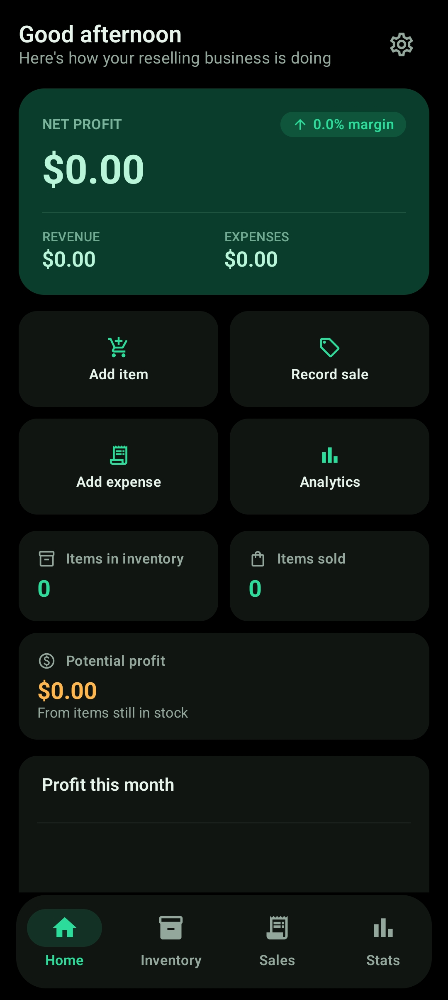
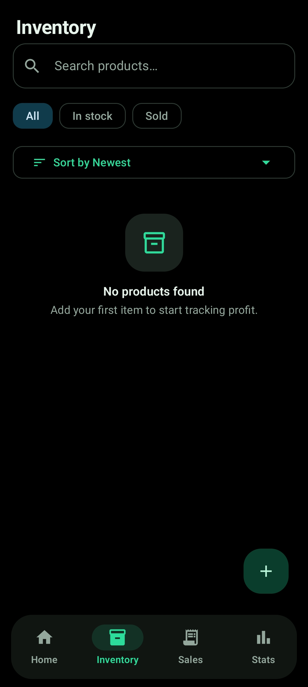
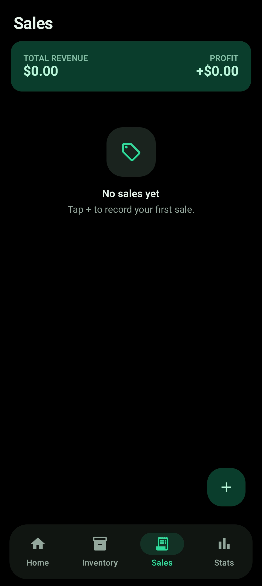
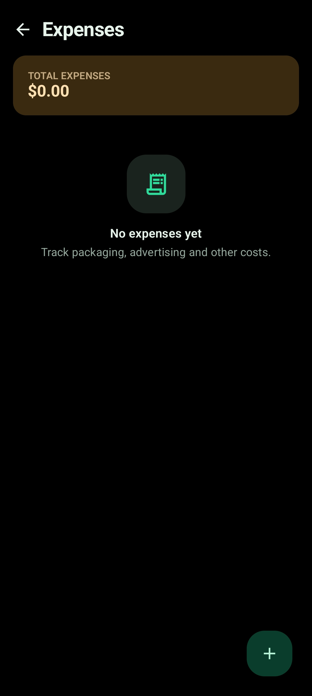
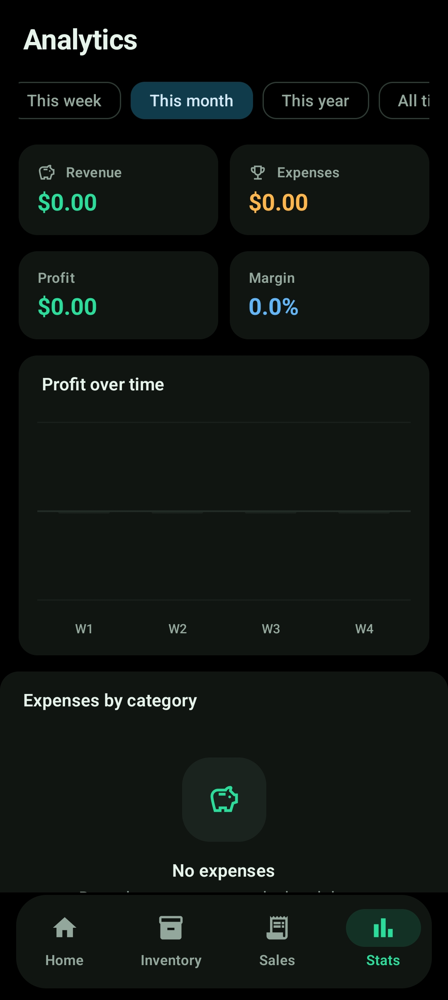
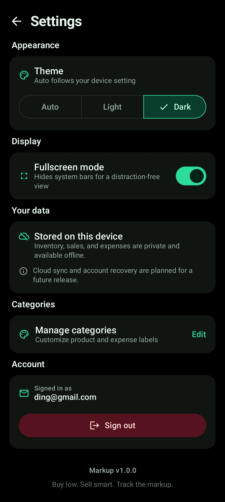

# Markup

> **Buy low. Sell smart. Track the markup.**

Markup is a polished, local-first Android app for independent resellers. It brings purchasing, inventory, sales, expenses, and profit reporting into one focused workspace—so a reseller can understand what is in stock, what has sold, and how the business is performing without relying on disconnected spreadsheets.

The current release is an offline MVP with a dark-first OLED interface, light-mode support, local account separation, product photography, responsive forms, editable categories, and data-driven analytics. It is designed as a portfolio-ready foundation for a future cloud-connected resale management product. The release configuration is optimized with R8 code shrinking and resource shrinking, and the app has been audited for unnecessary runtime dependencies, debug payloads, and unsafe local-data backup behavior.

[Highlights](#highlights) · [Tech stack](#tech-stack) · [Architecture](#architecture) · [Setup](#getting-started) · [Roadmap](#roadmap)

---

## Highlights

### Dashboard

The home screen gives users an immediate view of business health:

- Revenue, operating expenses, net profit, and profit margin
- Items currently in stock and sold transaction count
- Potential profit from remaining inventory
- Four-week net-profit chart with readable labels, gridlines, and negative-value support
- Recent sales with product thumbnails, sale amount, profit, and date
- Quick actions for adding inventory, recording sales, adding expenses, and opening analytics
- Time-aware greeting that changes between morning, afternoon, and evening
- Settings shortcut for appearance, fullscreen, categories, and account controls




### Inventory

Manage products in a searchable, responsive inventory workspace:

- Add and edit product name, category, purchase price, expected sale price, quantity, purchase date, notes, and photo
- Automatic expected-profit calculation while entering an item
- Search by product name or category
- Filter by all, in-stock, or sold products
- Sort by newest, oldest, highest expected profit, or lowest expected profit
- Product detail dialog with image, pricing, quantity, status, edit, sell, and delete actions
- Product cards with thumbnails, status chips, quantity, and key pricing information
- Long names and labels are constrained with sensible limits and ellipsis handling



### Sales

Record and review completed transactions:

- Select an available inventory item from a scrollable product picker
- Product thumbnails appear in the picker and sales history
- Enter sale price, sale date, optional buyer name, and notes
- See actual profit calculated as sale price minus purchase price
- Decrement multi-unit inventory one unit at a time
- Change inventory status to `SOLD` only when all units have been sold
- View total revenue, realized profit, buyer information, and sale history
- Delete a sale and restore one unit to the related inventory item
- User-scoped sale operations prevent data from crossing local accounts



### Expenses

Track operating costs that affect net profit:

- Packaging
- Advertising
- Repairs
- Shipping
- Fees
- Equipment
- Custom expense categories
- Optional notes and dates
- Expense totals included in dashboard and analytics calculations
- Category breakdown shown in analytics



### Analytics

Turn resale activity into practical business insight:

- This week, this month, this year, and all-time ranges
- Revenue, expenses, profit, and margin summaries
- Full-width horizontally scrollable period selection for compact phones
- Responsive profit-over-time chart with chronological buckets
- Net profit chart values include operating expenses
- Expense-by-category donut chart
- Best-performing product ranking
- All-time history includes an `Older` bucket rather than silently discarding older records
- Period-dependent expense and product rankings reflect the selected range
- Custom chart content includes an accessibility description for screen readers



### Settings

Settings centralizes appearance, display, category, and account preferences:

- Auto, light, or dark theme
- OLED-friendly immersive fullscreen mode
- Fullscreen preference persisted between launches
- Separate editable product and expense category lists
- Add, rename, or remove categories while preserving the `Other` fallback
- Local-first storage and privacy information
- Signed-in email display
- Confirmation dialog before signing out
- App version and brand information



---

## Product design

Markup is intentionally professional business software rather than a flashy dashboard:

- Dark-first visual system with a true OLED-black background
- Carefully tuned light mode with high-contrast text and controls
- Emerald primary accent with restrained supporting colors
- Rounded Material 3 cards, controls, dialogs, and menus
- Glass-inspired elevated popup surfaces that remain readable and native-feeling
- Consistent spacing, typography hierarchy, and status treatment
- Scrollable dialogs that remain usable on short displays
- Responsive horizontal controls that avoid clipping long labels
- Floating pill navigation for the primary destinations
- Edge-to-edge presentation with immersive system-bar handling
- Accessible descriptions for custom-drawn chart content
- Practical text limits and ellipsis behavior to protect layouts from long input

---

## Tech stack

- **Kotlin**
- **Jetpack Compose**
- **Material 3**
- **Android Studio**
- **MVVM-style presentation architecture**
- **Room** for local SQLite persistence
- **Kotlin Coroutines and Flow** for reactive state
- **Navigation Compose**
- **Coil** for product image loading
- **KSP** for Room code generation
- **Gradle Kotlin DSL**
- **Git/GitHub-ready project structure**

### Platform configuration

- Compile SDK: Android 35
- Target SDK: Android 35
- Minimum SDK: Android 8.0 / API 26
- Java and Kotlin target: JVM 17
- Application ID: `com.markup.app`

The MVP does **not** currently connect to Supabase, Firebase, or an AI provider. The repository boundary is storage-agnostic so a cloud implementation can be introduced without rewriting the screen layer.

---

## Architecture

```text
MainActivity
    ↓
MarkupTheme + MarkupApp
    ↓
Navigation Compose
    ↓
Screen ViewModels
    ↓
ProfitRepository interface
    ↓
RoomProfitRepository
    ↓
Room DAOs + SQLite
```

Business calculations live in the separate `ProfitMath` layer. UI-facing models are intentionally separated from Room entities, keeping storage and presentation decoupled.

### Current data entities

- `UserEntity`
- `ProductEntity`
- `SaleEntity`
- `ExpenseEntity`

Every product, sale, and expense query is scoped to the current local user. Local authentication stores a hashed development credential rather than plaintext passwords. Production authentication and account recovery are reserved for the cloud phase.

### Profit model

```text
Sale profit = sale price − purchase price
Net profit  = total realized sale profit − operating expenses
Margin      = net profit ÷ revenue × 100
Potential   = (expected sale price − purchase price) × remaining quantity
```

Deleting a sale restores one unit to inventory so inventory counts remain consistent with the transaction history.

---

## Getting started

### Requirements

- Android Studio with the Android SDK installed
- JDK 17
- Android SDK platform 35 or newer
- Android emulator or physical Android device
- Internet access on the first Gradle sync/build to resolve dependencies

### Open the project

Open this folder in Android Studio:

```text
C:\Freebuff\Portfolio\App 01
```

Allow Gradle to sync, then choose an emulator or connected device.

### Build the debug APK

From the project directory:

```bash
./gradlew :app:assembleDebug
```

On Windows:

```text
gradlew.bat :app:assembleDebug
```

The APK is generated at:

```text
app/build/outputs/apk/debug/app-debug.apk
```

### Install and run

```bash
./gradlew :app:installDebug
```

Alternatively, press **Run** in Android Studio.

### First-use flow

1. Create a local account with an email and password.
2. Add one or more inventory products.
3. Add a product photo if desired.
4. Record a sale from Inventory or Sales.
5. Add packaging, advertising, or other expenses.
6. Review the updated Dashboard and Analytics screens.
7. Open Settings to switch themes, manage categories, or change fullscreen behavior.

All data is currently stored locally on the device. Clearing app data or uninstalling the app removes the local database.

---

## Suggested portfolio demo

For a concise client-facing walkthrough:

1. Create a local Markup account.
2. Add **Nike Air Max** with a purchase price of `$40` and expected sale price of `$75`.
3. Add a photo and demonstrate the live `$35` expected-profit calculation.
4. Add a second product with a custom category using **Other**.
5. Record a sale at `$70` and show the `$30` realized profit.
6. Add a packaging or advertising expense.
7. Return to Dashboard and show the net-profit update and recent-sale thumbnail.
8. Open Analytics and switch between month, year, and all-time views.
9. Open Settings to demonstrate theme switching, category management, and fullscreen mode.

---

## Current scope and known boundaries

The current release is a polished offline MVP. It includes:

- Local sign-up, login, session persistence, and logout confirmation
- Local user-scoped data
- Dashboard with financial summaries and responsive charts
- Inventory management with product photos
- Sale recording, sale history, and inventory reconciliation
- Expense tracking and category aggregation
- Search, filtering, and sorting
- Custom product and expense categories
- Dark/light/automatic themes
- OLED-friendly immersive fullscreen mode
- Responsive, scrollable dialogs and long-text protection
- Basic analytics and accessibility support for custom charts

The following are intentionally not presented as implemented features yet:

- Cross-device synchronization
- Remote authentication or account recovery
- Cloud image storage
- AI-generated insights
- CSV/PDF export
- Notifications
- Automated backups

---

## Release audit

The project has completed a conservative release-readiness pass focused on keeping the shipped app lean without changing user-facing functionality:

- Runtime dependencies were checked against actual source usage; no unused feature library or shipped debug-only dependency was found.
- Release builds enable R8 code shrinking and resource shrinking.
- Debug and test tooling remains scoped to debug/test configurations and is not packaged in the release APK.
- Local Room data and preferences are excluded from cloud backup and device transfer because cloud recovery is not implemented yet.
- Launcher adaptive icons include themed monochrome support.
- User input remains bounded and dialogs remain scrollable on compact devices.
- Sale/inventory reconciliation, user scoping, image propagation, analytics ranges, and fullscreen behavior were rechecked during the final audit.

The release APK generated by Gradle is an **unsigned release artifact**. A keystore-signed APK or Play-ready App Bundle still requires the publisher’s signing identity and store configuration.

### Final validation snapshot

Validated on **September 5, 2026** with the Android SDK platforms available in this workspace:

- `:app:assembleDebug` — passed
- `:app:assembleRelease` — passed
- `:app:lintRelease` — passed
- Release APK size — approximately **1.7 MB** after shrinking
- Debug APK size — approximately **18 MB**; debug/test tooling is configuration-scoped and is not included in the optimized release build
- Release artifact — `app/build/outputs/apk/release/app-release-unsigned.apk`

Lint still reports advisory maintenance notices for dependency versions, the locally installed target-SDK horizon, and the API-qualified adaptive-icon folder. These do not indicate unused app features, shipped debug tooling, compilation errors, or a release-blocking issue; the adaptive-icon qualifier is retained because moving the adaptive XMLs into an unqualified folder breaks Android resource linking for this project.

The generated `.gradle`, `build`, and `app/build` directories are local build caches/output, are ignored by Git, and are not app source or shipped “bloatware.” They can be regenerated and should not be committed.

## Roadmap

### Version 2 — Cloud-connected workspace

- Supabase or Firebase authentication
- Cloud database synchronization
- Row-level user data security
- Cross-device inventory access
- Cloud image storage
- Offline-first sync conflict handling
- CSV and PDF export
- Expanded date-range and comparison reports
- Sale and expense audit history
- Automated backup and restore

### Version 3 — AI Business Assistant

The AI assistant will be introduced only after the standard data workflows are cloud-ready and reliable. It will use structured, purpose-limited context instead of sending the entire database to an AI provider.

```text
User question
    ↓
Question intent detection
    ↓
Retrieve only relevant structured metrics
    ↓
Send minimal, safe context to the AI API
    ↓
Return a concise business insight
```

Potential questions include:

- “How much profit did I make this month?”
- “What is my most profitable product?”
- “Which category makes me the most money?”
- “What products are sitting in inventory?”
- “Summarize my business this month.”
- “What products should I consider buying more of?”

### Longer-term opportunities

- Aging-inventory alerts
- Inventory turnover and sell-through metrics
- Profit forecasting
- Bulk imports
- Barcode scanning
- Multi-currency support
- Multiple business profiles
- Team permissions
- Automated monthly reports

---

## Screenshots

Add real emulator screenshots to `docs/screenshots/` using these filenames:

```text
docs/screenshots/dashboard.jpg
docs/screenshots/inventory.jpg
docs/screenshots/sales.jpg
docs/screenshots/expenses.jpg
docs/screenshots/analytics.jpg
docs/screenshots/settings.jpg
```

The image links currently act as portfolio placeholders. Capture the app on a representative phone emulator before publishing the repository publicly.

---

## Portfolio positioning

Markup demonstrates more than a collection of screens. It shows:

- Product thinking around a real resale workflow
- A coherent visual system across dark and light modes
- Reactive, data-driven Compose UI backed by Room and Flow
- Separation between UI, repository, and business-calculation layers
- Responsive Android layouts for compact and larger devices
- Practical inventory integrity across sale, deletion, and multi-unit flows
- Local privacy boundaries and user-scoped data access
- A staged roadmap from offline MVP to cloud sync and structured-data AI

## Verification

Run the following checks from the project root before handing the app to a client or publishing it:

```bash
./gradlew clean :app:assembleDebug
./gradlew :app:assembleRelease
./gradlew :app:lintRelease
```

On Windows, use `gradlew.bat` instead of `./gradlew`. A release handoff should also include testing on at least one compact phone, one large phone, and both light and dark system themes. Automated UI coverage for the primary sale flow and screenshot capture remain recommended next steps.

## License

This is a portfolio application. Add a license before distributing the project publicly.
